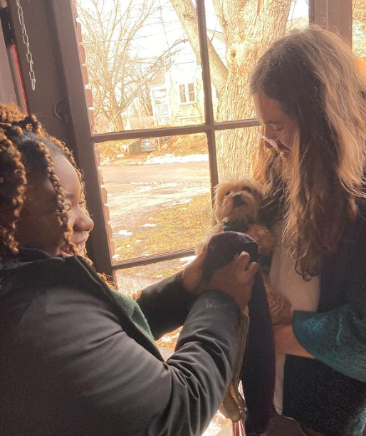

# Henry Knollenberg's Week 2 Blog

## What is something you wish you could do but currently do not have the coding skills to accomplish?
Anything with javascript. Besides that though, or in addition to, I would like to learn how to make a proper
blog - one with a timeline of content on the main page, rather than having to link to each separate blog entry. 
I'd like the website to be able to do both. I'd also like to learn how to make separate pages without having to 
copy/paste html into a new file each time. Finally, there are some very cool Literature Magazines that I'd like
to emulate (or do something similar) with my own author page. A couple examples are [new_sinews](https://www.newnewsinews.com/about) 
and [Mannequin Haus](http://infii2.weebly.com/). 

## What are you struggling with?
My main struggle currently is being able to do what I want in css. By this I mean being able to visualize
exactly what a property change will affect. Using flex is getting easier, but anything that has to do with
the general layout of the page can get fairly confusing real quick. This along with pseudo elements and positioning.

## How do you solve a problem?
1. First, try to figure it out myself - tinkering with whatever I'm working on, trying to understand the problem. 
2. If that doesn't work, I'll try to find an example of my problem online to see if someone else has had the same issue; 
most of the time someone has. 
3. Finally, if that doesn't work, I'll ask an expert, like my coding instructors in the program, or even non-experts, 
like my fellow students, who have likely run into similar issues and might know the right fix. 

## What methods do you use to help yourself get unstuck?
* Taking a break can help, although I'm often wary to do so as I am stubborn and want to figure out the issue. Regardless,
the step away from the computer, or whatever else I'm working on, can be very helpful. 
* Eat - sometimes when I'm stuck on something I will forget to eat food. This is not good for the brain and can just 
exacerbate the issue. Taking time to eat can also serve as taking a break.
* Each of the steps listed under *How do you solve a problem?*